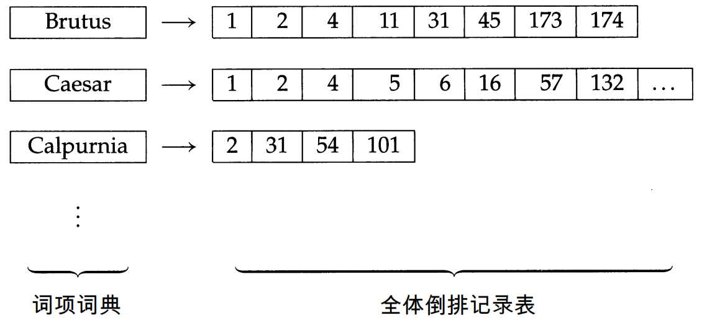

# 自然语言处理与信息检索

## 基础篇

### 分词（Tokenization）

**分词**（Tokenization）定义：将句子、段落分解为字词单位（Token），方便后续的处理和分析。

【**常用的中文分词工具**】：

* jieba（最常用）：https://github.com/fxsjy/jieba
* Hanlp（最活跃）：https://github.com/hankcs/HanLP
* THULAC（清华大学）：https://github.com/thunlp/THULAC-Python

分词后可以尝试的其他技巧：

1. 去除停用词：某些情况下，一些常用词在文档和用户需求进行匹配时价值不大，可以去除掉，这些词被称为停用词（stop word）。
    * 停用词可以直接手动构造；也可以统计分词在文档中出现的频率从高到低排序，手动选出和语义无关的分词。
2. 分词（token）归一化：将看起来不完全一致的多个token归纳成一个等价类。
    * 例子（英文中更常见）：当查询windows的时候，应当匹配的token还需要包括【windows, Windows, window】，因此需要大小写转换、去除单词两端的词缀（词干提取/词干化）。

### 信息检索入门理解

本次编程实验中的网页搜索功能，就是实现一个简易的信息检索系统。我们可以通过一个简单的例子来直观感受信息检索：

> 《论语》作为儒家经典著作，全书有20篇492章，总字数超过15000字。如果你想知道其中哪些章节出现了子路但是没有出现子贡，一种办法是从头到尾阅读全书，对每一个章节都检查是否满足“出现子路不出现子贡”的要求。这种线性扫描是最简单的计算机文档检索方式。（英文称为grepping，源自Unix的一个文本扫描命令grep）

但是，这种线性扫描的方式对于大规模文档来说非常低效（想象一下把图书馆的书籍去掉所有分类标签体系杂乱堆在一起，你再去一本一本地找书）。因此，高效的信息检索需要采取非线性的方法，例如事先给文档建立索引（index）。

接下来我们将介绍信息检索中最核心最经典的概念之一：倒排索引。

## 进阶篇（可以不看）

> 注意：本次实验中搜索页面和搜索性能的分数是分开的，线性扫描而不建立索引只有可能丢失少数搜索性能的分数（取决于有没有其他优化、实际有多慢）；如果你来不及实现倒排索引，不必焦虑，也可以尝试其他优化方法。

### 倒排索引

> 以下部分内容源自《信息检索导论》（曼宁等著）

索引（index）的基本逻辑：从词项反向映射到文档。

下图展示了倒排索引（inverted index）的基本思想：

我们先来看图中各个部分都是什么意思：

左部称为`词项词典（dictionary）`，由一系列`词项`组成。
> 如果把上文的分词章节得到的`分词（token）`汇总起来，就可以得到一个`词项词典`，每个`分词（token）`作为一个`词项`。

右部展示了每个`词项`都有一个`倒排记录表`：记录出现该`词项`的所有`文档`信息（例如图中的数字就是文档编号）。

当我们搜索某个`词项`的时候，就可以直接通过该`词项`的`倒排记录表`找到对应的文档。

那么，这样一个倒排索引应该如何构建呢？下图展示了一个简单的例子：

1. 第一步（图左部）：每篇文档的所有词项 + 文档编号，组成列表
2. 第二步（图中部）：按照词项的字母顺序排序
2. 第三步（图右部）：同一词项合并，得到`词项词典` + `倒排记录表`

到目前为止，我们已经建立了最简单的倒排索引。但是聪明的你可能会提出这样一些问题：

问题一：我们的查询（query）文本可能不是单个词，而是一句话或者一段话（很多个词），阁下该如何应对呢？

> 你说的对，但是我们可以把任何文段的查询（query）看成是多个词组成的集合，基于每个查询词项与文档的匹配情况，通过合理的加权求和等方法，进行检索匹配。

问题二：我们在倒排索引中只区分了文档中有没有出现某个`词项`，并没有区分不同`词项`和不同`文档`的匹配“程度”。

> 是的，所以接下来我们将介绍tf-idf的算法。

### tf-idf计算

#### 词项频率（term frequency，即tf-idf中的tf）

我们先通过一个简单的例子解释词项频率有什么意义：

> 在简单的倒排索引中，我们对每个词项只记录了出现这个词项的文档有哪些，并没有记录文档中出现了几次这个词项。如果有两篇文章，一篇介绍梅西（显然文档中出现很多次“梅西”），一篇介绍姆巴佩（但是文档中出现了一次“梅西”），这两篇文章在倒排索引中的“优先级”是没有区别的。但是我们显然想要那篇出现了很多次“梅西”的文章。

词项频率的定义：对于词项`t`，其在文档`d`中出现的次数，称为词项频率（`tf`），记为$tf_{t,d}$。

#### 逆文档频率（inverse document frequency，即tf-idf中的idf）

只看词项频率会遇到严重的问题，因为到目前为止，我们都认为所有`词项`是同等重要的。下面是一个词项频率失效的例子：

> 考虑有关人工智能的文档集中，几乎所有的文档都会包含“机器学习”，此时，计算“机器学习”的词项频率对我们选出真正想要的文档意义不大。

为此，我们可以提出一种机制，使得这些出现次数过多的词项，重要性被削弱。定义文档频率（document frequency）：对于词项`t`，出现`t`的文档数目，称为文档频率，记为$df_t$。

由于$df_t$数值较大，为了计算方便，通常会把它映射到较小的取值范围内（取倒数、取对数）。假定所有文档的数量为$N$，对于词项`t`，定义逆文档频率$idf_t = lg \frac{N}{df_t}$。

#### tf-idf权重计算

对于每篇文档中的每个词项，可以将其`tf`和`idf`组合在一起形成最终的权重。`tf-idf`权重机制对文档`d`中的词项`t`赋予的权重如下：

$$tf \text{-} idf_{t,d} = tf_{t,d} \times idf_t $$

我们可以用$tf \text{-} idf_{t,d}$来表示词项`t`和文档`d`匹配的指标。对于由若干词项组成的查询`q`来说，可以求和计算：

$$Score(q,d) = \sum_{t \in q} tf \text{-} idf_{t,d}$$

以上就是需要理解的所有基础原理。关于进一步的优化方法，可以自行查阅相关资料；具体的代码实现需要自己完成哦。