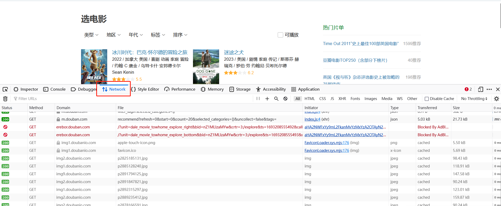
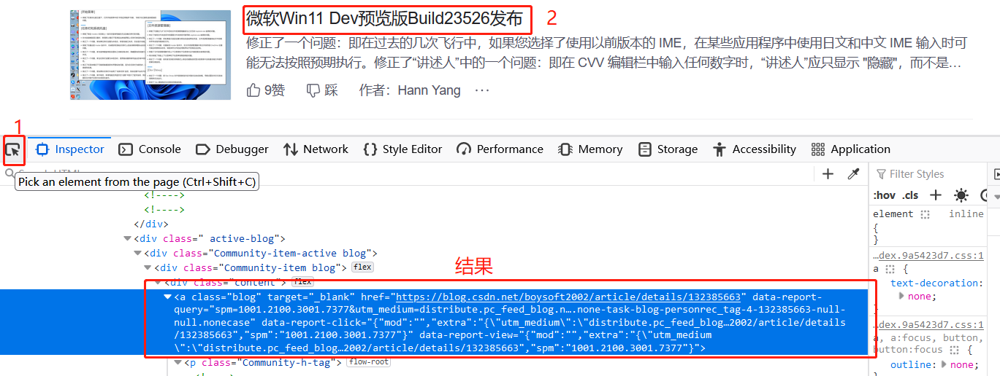
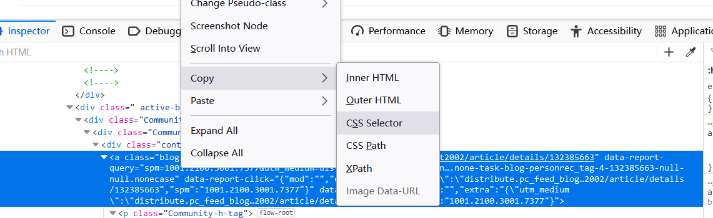

# 爬虫
在本次大作业中，我们要搭建一个新闻网站，需要从多个互联网平台上提取文本、图片等内容，为了快速地从网站批量获取数据，我们可以构建爬虫自动从互联网抓取信息。Python语言提供了强大的网络请求与数据处理工具，被广泛用于编写爬虫。

爬虫的工作方式与我们上网的过程类似，都可以概括为两步：首先从互联网中获取网页内容，再加工转化为有用的信息。接下来，我们会从这两个步骤入手，逐步介绍如何构建一个简单爬虫。

## 网络请求

### Requests
无论是浏览器打开网页还是爬虫获取网站信息，都需要与目标网站所在服务器建立连接，向其发送请求，再接收网页内容。

Python中常用`requests`库发起网络请求。下面是一个使用`request`获取CSDN首页内容的示例：

```python
import requests

headers = {'User-Agent': 'Mozilla/5.0 (Windows NT 10.0; Win64; x64; rv:109.0) Gecko/20100101 Firefox/116.0'}
response = requests.get('https://blog.csdn.net/', params={}, headers=headers)
response.encoding = 'UTF-8'

html = response.text
```
此处我们发送HTTP GET请求，获取CSDN首页的内容：

* `requests.get`使用`GET`方式发送请求，其常用于获取数据。还有其它常见的请求方法，比如`POST`常用于将数据发送至服务器，以更新服务端数据或模拟登陆等。
* `params`参数以字典形式传递`GET`请求参数，相当于url中`?`后面的参数部分。在分页查看数据等场景下需要传递。
* `headers`参数以字典形式传递请求消息头，如主机和端口`Host`、内容类型`Content-Type`、认证信息`Authorization`、浏览器类型`User-Agent`、Cookie`Cookie`等，此处设置了`User-Agent`。部分存在反爬机制的网站会拦截由裸程序发出的请求，设置`User-Agent`可以将本请求伪装为从浏览器发出，在一定程度上绕过反爬机制。对于部分需要`Cookie`认证访问的网站（如知乎），需要设置`Cookie`项以通过相应认证。

得到的响应存储于`response`中，通过`response.text`获取其内容，此处为CSDN首页的HTML代码。

在实际使用时，response的内容可能有多种形式：

* 文本形式，比如HTML代码，可通过`response.text`获取文本字符串；
* JSON形式，可使用`response.json()`方法获取JSON形式数据；
* 二进制形式，如图片等文件，可使用`response.content`获取字节串并通过`open('filename', 'wb').write`写入文件。

需要注意，部分网站会针对爬虫类型限制爬取的范围与频率，可以通过 robots.txt 查看，例如访问[https://blog.csdn.net/robots.txt](https://blog.csdn.net/robots.txt)，在爬取时需要尊重并遵守 robots.txt 中的限制；此外，短时间内发送大量请求会增大网页服务器的负担（参考DoS与DDoS攻击），部分网站也会封禁频繁发送请求的IP地址，故在不同请求之间应该间隔充足的时间，比如使用`time.sleep(random.uniform(1, 2))`停止秒数在1-2之间的随机值的时间。

除了`requests`库外，还可以使用`urllib.request`等其它模块发起请求。

### 快速获取网页列表
在爬新闻的时候我们常常会先获取所有新闻网页的链接，再逐个爬取单个新闻的详细信息。下面介绍两种获取网页列表的方法。

#### 直接提取网页内容
多数网页的展示内容位于所爬取的内容中，可以直接提取。以豆瓣片单为例，获取某片单所在网址的内容：

```python
headers = {
    "User-Agent": "Mozilla/5.0 (Windows NT 10.0; Win64; x64; rv:109.0) Gecko/20100101 Firefox/116.0",
}
params = {'start': 0, 'sort': 'time', 'playable': 0}
print(requests.get('https://www.douban.com/doulist/669101', params=params, headers=headers).text)
```

此处我们发起GET请求。由于豆瓣是分页展示内容，要获取多页内容需要传入请求参数，此处设置起始位置为0。得到的部分内容如下：
```html
<div id="item4174711" class="doulist-item" >
   <div class="mod">
      <div class="hd"></div>
      <div class="bd doulist-subject">
         ...
         <div class="title">
            <a href="https://movie.douban.com/subject/1295399/" target="_blank">
            
            七武士 七人の侍
            </a>
         </div>
         ...
      </div>
      ...
   </div>
</div>
<div id="item4174709" class="doulist-item" >
   <div class="mod">
      <div class="hd">
      </div>
      <div class="bd doulist-subject">
         ...
         <div class="title">
            <a href="https://movie.douban.com/subject/1292215/" target="_blank">
            
            天使爱美丽 Le fabuleux destin d&#39;Amélie Poulain
            </a>
         </div>
         ...
      </div>
      ...
   </div>
</div>
...
```
之后即可用下文将要介绍的数据清洗工具提取网页列表。

#### API获取列表
部分网页难以直接通过直接请求页面内容大量获得列表信息，比如将数据存入JQuery而非HTML中，或者需要通过下滑等方式让浏览器额外请求得到。一种解决方法是用Selenium等工具模拟浏览器行为以获取数据，可参考后文Selenium相关资料；除此之外，还可以寻找获取网站数据的API，直接请求格式化的数据。在上网时，浏览器所获得的一切数据都需要通过网络请求得到，请求结果不仅包含网页主体的HTML代码，还包含其它形式的数据，比如JavaScript代码、json等，它们通常已经被格式化，可以被直接使用。如果找到这类请求数据接口的域名、参数等信息，就可以向这些接口直接请求获得数据。

浏览器的网络行为可以用开发者工具查看，通过按F12调出，在顶部选择“网络”项即可查看本页面发送的请求。



这些请求会返回多种数据，包括json、图片、js等。

还是以豆瓣为例，豆瓣提供了一个页面用于根据类别查看电影列表：[https://movie.douban.com/explore](https://movie.douban.com/explore)，我们要爬取华语电影类别。但该页面单次显示的条目较少，我们希望自动获得大量的条目。通过点击网页中的“加载更多”按钮可以显示更多的条目，我们用开发者工具查看点击该按钮时，浏览器发出了什么请求。我们一般关注json形式的请求，因为它常被用于发送数据；我们可以仅查看XHR以只查看json之类的数据：


找到某一请求返回了json类型数据，且数据内容恰好是新加载的列表内容，这个接口就是我们要找的数据API。

查看该请求的各部分，其url为`https://m.douban.com/rexxar/api/v2/movie/recommend`，各项参数如下：

```
params = {
    'refresh': 0,
    'start': 20,
    'count': 20,
    'selected_categories': '{"地区":"华语"}',
    'uncollect': False,
    'tags': '
}
headers = {
    'User-Agent': 'Mozilla/5.0 (Windows NT 10.0; Win64; x64; rv:109.0) Gecko/20100101 Firefox/116.0',
    'Cookie': 'viewed="26341814"; bid=nZ1MLIzaMYw; ll="108288"; douban-fav-remind=1; ap_v=0,6.0',
    'Accept': 'application/json, text/plain, */*',
    'Accept-Language': 'en-US,en;q=0.5',
    'Accept-Encoding': 'gzip, deflate, br',
    'Referer': 'https://movie.douban.com/explore',
    'Origin': 'https://movie.douban.com',
    'Connection': 'keep-alive',
    'Cookie': 'viewed="26341814"; bid=nZ1MLIzaMYw; ll="108288"; douban-fav-remind=1; ap_v=0,6.0',
    'Sec-Fetch-Dest': 'empty',
    'Sec-Fetch-Mode': 'cors',
    'Sec-Fetch-Site': 'same-site',
}
```

我们基于这一套参数，在Python中发送一个请求：

```python
# 去掉了部分无用参数
params = {
    'start': 20,
    'count': 20,
    'selected_categories': '{"地区":"华语"}',
    'tags': '华语'
}
headers = {
    'User-Agent': 'Mozilla/5.0 (Windows NT 10.0; Win64; x64; rv:109.0) Gecko/20100101 Firefox/116.0',
    'Referer': 'https://movie.douban.com/explore',
}
response = requests.get('https://m.douban.com/rexxar/api/v2/movie/recommend', params=params, headers=headers)
response.encoding = 'UTF-8'
response.json()['items']
```

输出的大致内容如下：

```
[{...
  'year': '2023',
  'card_subtitle': '2023 / 中国大陆 / 剧情 喜剧 / 大鹏 / 黄渤 王一博',
  'id': '35556001',
  'title': '热烈',
  'tags': [{'name': '2023最值得期待的影视',
    'uri': 'douban://douban.com/subject_collection/ECGM6JFQI?category=movie&rank_type=year&type=rank'},
   {'name': '中国大陆 喜剧 搞笑',
    'uri': 'douban://douban.com/movie/recommend_tag?tag=%E4%B8%AD%E5%9B%BD%E5%A4%A7%E9%99%86%2C%E5%96%9C%E5%89%A7%2C%E6%90%9E%E7%AC%91&type=tags'}],
  'uri': 'douban://douban.com/movie/35556001',
  'episodes_info': '',
  'item_type': 'movie'},
 {...
  'year': '2018',
  'card_subtitle': '2018 / 美国 中国大陆 / 剧情 喜剧 音乐 传记 / 彼得·法雷里 / 维果·莫腾森 马赫沙拉·阿里',
  'id': '27060077',
  'title': '绿皮书',
  'tags': [{'name': '豆瓣电影Top250',
    'uri': 'douban://douban.com/subject_collection/movie_top250'},
   {'name': '美国 种族 温情',
    'uri': 'douban://douban.com/movie/recommend_tag?tag=%E7%BE%8E%E5%9B%BD%2C%E7%A7%8D%E6%97%8F%2C%E6%B8%A9%E6%83%85&type=tags'},
   {'name': '金球奖 最佳男配角 获奖作品', 'uri': 'douban://douban.com/doulist/111730341'}],
  'uri': 'douban://douban.com/movie/27060077',
  'episodes_info': '',
  'item_type': 'movie'},
  ...
]
```

即为我们需要的列表。观察到列表中的每一项有一个字段'uri'，其以一串数字结尾；再随便打开一个电影的网页，其链接为`https://movie.douban.com/subject/27060077/`，结尾恰好为uri结尾的数字，故可以根据列表中的信息找到对应的页面链接。

### Selenium
有时候我们不仅要直接从网页获取信息，还要和网页进行主动交互，比如输入信息、下滑窗口等，这需要在网页中执行操作。一种可用的工具是Selenium，它是一个用于控制浏览器行为的自动化测试框架，可以模拟用户在浏览器中的操作。

Selenium的基础操作可以参考GeeksforGeeks教程[Selenium Python Tutorial - GeeksforGeeks](https://www.geeksforgeeks.org/selenium-python-tutorial)，在[科协暑培教程](https://summer23.net9.org/backend/crawler/#32-selenium-webdriver)中也有示例代码，同学们可以参考。

## 数据清洗
通过网络请求我们可以得到大量的数据，然而数据常常以前端代码、格式混乱的文本等形式存在，要让其变成高质量、可用的信息还需要细致的清洗。接下来我们将学习网页数据的常见形式HTML，以及抽取数据的一系列工具。

### HTML基础
我们在浏览器上看到的网页是由前端代码渲染得到的，前端代码控制着网页的多个方面，如HTML控制数据内容、CSS控制展示效果、JS控制动态交互等，我们爬取的网页一般为**HTML**代码。HTML全称为HyperText Markup Language(超文本标记语言)，顾名思义，通过各类标记控制页面的文本、图片等元素。

一个HTML文件的基本结构示例如下：
```html
<html>
    <head>
        <meta charset='utf-8'>
        <title>Title</title> <!-- 标题 -->
        <script src='...'></script> <!-- 外部JS代码 -->
    </head>
    <body>
        <h1>Heading</h1>
        <div id='block_1'>
            <p>段落</p>
            <a class='blog' href='https://...'>链接</a>
            <span class='blog-text'>博客内容</span>
        </div>
    </body>
</html>
```
其中`<head>`包含关于文档的元信息；`<body>`包含网页的主要内容，会在浏览器中显示出来，此处的`h1`、`div`、`p`、`a`分别为一级标题、块、段落、链接元素。元素可以添加`class`与`id`属性以作标识，它们被用于CSS与JavaScript操作，也能让爬虫识别特定内容。

### 正则表达式
HTML等数据具有固定的格式，可以通过自动识别模式进行抽取；部分数据项，例如网页URL、电子邮件地址、形式有规律的文本，也可以基于一定的规则抽取出来。正则表达式（Regular Expression, Regex）是一种文本模式匹配工具，用于在文本中搜索、匹配和处理特定模式的字符串。

在Python中，正则表达式的各种方法需要`import re`后使用。正则表达式是由字母和符号组成的特殊文本，其形式可以为普通字符串，通过`re`库的各种方法使用；也可以用`re.compile`将普通字符串转化为一个正则表达式对象，再直接调用该对象的各种方法。

正则表达式定义了匹配文本的规则：

1. 首先，对于大多数字符，正则表达式用其本身匹配之，如要匹配字符串'Hello, regex!'，只需一个形如'Hello, regex!'的正则表达式匹配之。'\n'、'\t'等普通字符串中的转义字符也是如此。
2. 部分字符存在特殊的匹配功能，用于表达规则，作为普通字符使用的话需要加上'\'转义符号。

常见的特殊字符与字符簇（多个字符组成的模式）如下：

1. '^'匹配字符串开头，'$'匹配字符串结尾，比如'^python'只能匹配字符串开头的'python'，'^python$'需要整个字符串只包含'python'。
2. **通配**：'.'匹配除换行符'\n'、'\r'之外的任何单字符.
3. 方括号'[...]'匹配单个字符，这个字符只能是方括号内字符中的任意一个，比如'[re]'只能匹配'r'或'e'
4. 方括号'[^...]'匹配单个字符，这个字符不能是方括号内字符中的任意一个，，相当于对'[...]'取反，比如'[re]'只能匹配非'r'或'e'的任意其它字符。
5. [A-Z]匹配所有大写字符，[a-z]匹配所有小写字符，[0-9]匹配所有数字。方括号可以组合，比如'[A-Z0-9_]'匹配所有大写字母、数字和下划线。
6. '\d'等价'[0-9]'；'\D'等价'[^0-9]'；'\s'匹配所有空白字符，如\t,\n；'\S'匹配所有非空白字符；'\w'匹配字母、数字、下划线，等价于'[A-Za-z0-9_]'。
7. **重复匹配**：'x{n}'代表前面内容出现次数重复n次，'x{n, m}'代表前面内容出现次数重复[n, m]次，'x{n,}'代表前面内容出现次数重复多于n次，其中'x'为单个字符或字符簇。如'a{2,}'匹配'a'出现不少于2次的字符串。
8. **重复匹配**：'x?'代表前面内容出现次数重复0或1次（即可以不出现），'x+'代表前面内容出现至少一次，'x*'代表前面内容出现0或多次。**.\*常用于匹配单行内任意内容**。
9. **或连接符**：'aaaa|bbbb'可以匹配'aaaa'或'bbbb'。
10. **圆括号**：'()'可用于改变或连接符的优先级，如'(a|b)aaa'匹配'aaaa'或'baaa'。此外，圆括号具有标识**捕获分组**的功能，将在后文详细介绍。

可以基于这些规则编写许多复杂的正则表达式。例如，'\d*-[A-Za-z]*'匹配的字符串前半部分为数字序列，后半部分为字母序列，两部分用'-'连接。

正则表达式一般用于三种用途：

1. 匹配：判断整个字符串是否符合模式。在Python中为`re.match(pattern, inputs_string)`。
2. 搜索：查找所有符合模式的子串。在Python中有`re.search`、`re.findall`等多种方法，同学们可根据具体用途选择。
3. 替换：将符合模式的子串替换。在Python中为`re.sub(pattern, repl, input_string)`。

例如，`re.findall('\d+', '123qwe456')`可以匹配'123qwe456'中的所有数字子串，此处为`['123', '456']`。

此外，圆括号可以在搜索时捕获特定分组。被圆括号包裹的内容称为分组，可以被单独捕获。比如'(\d*)-([A-Za-z]*)'在这个模式里定义了前后两个分组。对比以下两行代码：
```python
re.findall('\d*-[A-Za-z]*', '123-aaaaa, 456-bbbbb')
# ['123-aaaaa', '456-bbbbb']

re.findall('(\d*)-([A-Za-z]*)', '123-aaaaa, 456-bbbbb')
# [('123', 'aaaaa'), ('456', 'bbbbb')]
```
可以发现带有分组的正则表达式会捕获括号中的关键信息。其它函数也可以利用分组进行匹配，如在`re.search`后可通过`groups()`或`group(num_group)`查看分组捕获的内容。

如果只想用圆括号表达优先级而不标记分组，可以用`(?:content)`形式。

重复匹配存在贪婪与懒惰匹配之分。以'\*'为例，在贪婪模式下，'\*'会匹配尽可能多的重复次数；在懒惰模式下其会匹配尽可能少的重复次数。一般默认为贪婪匹配，将'\*'改为'\*?'可切换为懒惰匹配。例如，`re.search('a*', 'aaaaaaa')`的匹配结果为`'aaaaaaa'`，而`re.search('a*?', 'aaaaaaa')`的结果为`''`（重复尽可能少，即零次）。部分场景下需要格外注意两种模式，比如需要提取出'(q)wert(y)'中所有被括号包裹的子串，此时使用`\(.*\)`贪婪匹配，会匹配开头和结尾的括号，中间的字符（包括括号）全部被通配符匹配，得到的是`'(q)wert(y)'`整个串；使用`\(.*?\)`懒惰匹配则会得到`(q)`和`(y)`两个子串。

正则表达式是基于什么原理进行匹配的呢？同学们会在“形式语言与自动机”课程中深入学习相关知识。

**探索**：'.'默认不能匹配'\n'、'\r'换行符，可以怎么配置使其能够匹配换行符？

**自测练习**：写一个正则表达式匹配电子邮件地址。

### BeautifulSoup
上文的正则表达式适用于各类场景，其适用范围远不止爬虫。爬虫对HTML文本的针对性较强，可以选用专门解析HTML格式数据的工具，其中较为常见的一个就是 BeautifulSoup。接下来，我们用 BeautifulSoup 解析上文爬取的 CSDN 首页代码。

首先，使用以下命令安装 BeautifulSoup：
```bash
pip install bs4
```

再将响应文本构建为`BeautifulSoup`对象：
```python
from bs4 import BeautifulSoup

soup = BeautifulSoup(response.text)
```
之后可以调用`soup`的`find`或`find_all`方法，寻找在HTML中符合条件的单个或多个元素。

`find`与`find_all`的第一个参数为标签名，如'span', 'div', 'a'等，其余参数为元素的属性值。例如，寻找所有class属性为'blog'的链接元素：
```python
soup.find_all('a', class_='blog') # class为Python关键字，此处参数名为class_
```
该代码返回一个结果集合，其中每一项可以继续调用查找的函数。

对于单个元素，可以用`.text`提取其所有文本内容；提取其属性值可以用`get()`方法。例如获取页面中所有博客的链接：
```python
links = [link.get('href') for link in soup.find_all('a', class_='blog')]
```

#### CSS Selector
手写BeautifulSoup代码一般需要被提取的元素有比较明显的属性、标签或者查找路径。如果某个元素在HTML中的位置非常复杂，难以手动提取出来，则可以借助 CSS Selector 快速写出查找到它的路径。

每一个元素都可以通过一个 CSS Selector 找到。CSS Selector可以借助浏览器查找，以Firefox为例：

1. 使用F12调出开发者工具，找到该元素对应的HTML
   
2. 右键单击HTML代码，点击Copy->CSS Selector以复制路径到剪贴板
   

此处的剪贴板内容为：
```
div.active-blog:nth-child(4) > div:nth-child(1) > div:nth-child(1) > div:nth-child(1) > a:nth-child(1)
```
其指向所选中的元素。

若希望该路径指向多个元素，可对其略微修改，比如去掉第一项的`:nth-child(4)`：
```
div.active-blog > div:nth-child(1) > div:nth-child(1) > div:nth-child(1) > a:nth-child(1)
```
即可指向所有块内相同位置的元素。

使用`soup.select`可以提取出CSS Selector指向的所有元素：
```python
soup.select('div.active-blog > div:nth-child(1) > div:nth-child(1) > div:nth-child(1) > a:nth-child(1)')
```


## 参考
[Python 网络请求与爬虫基础 - SAST skill docs](https://docs.net9.org/languages/python/crawler/)

[爬虫 - 酒井科协暑培 2023](https://summer23.net9.org/backend/crawler)

[Quick tip: HTML tags (article) | Khan Academy](https://www.khanacademy.org/computing/computer-programming/html-css/intro-to-html/a/quick-tip-html-tags)

[正则表达式 – 教程 | 菜鸟教程](https://www.runoob.com/regexp/regexp-tutorial.html)
