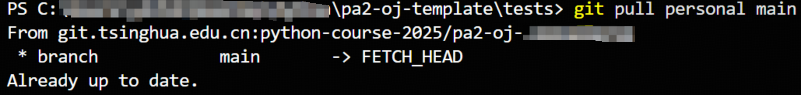

# 仓库拉取教程

相信在之前的学习中，大家已经初步了解了在自己仓库中进行 git 操作，比如 `git add`、`git clone`、`git commit`、`git push`。

不过，我们在更多情况下使用 git 是为了与他人合作，那么如何将自己代码与他人代码以不冲突的方式合并呢？

---

## 前置知识回顾

我们已经掌握了一些基础的 Git 命令：

* `git clone`：克隆远程仓库到本地
* `git add`：将修改添加到暂存区
* `git commit`：提交修改
* `git push`：推送代码到远程仓库

但多人协作时，我们还需学会：

* 添加多个远程仓库
* 从其他远程仓库拉取代码
* 合并或重放（rebase）改动
* 解决冲突

---

## 克隆你的作业仓库

```bash
git clone https://git.tsinghua.edu.cn/<git-space>/<repo-name>.git
cd <repo-name>
```

```shell
git clone https://git.tsinghua.edu.cn/python-course-2025/pa2-oj-2025123456.git
Cloning into 'pa2-oj-2025123456'...
remote: Enumerating objects: 3, done.
remote: Counting objects: 100% (3/3), done.
remote: Compressing objects: 100% (2/2), done.
remote: Total 3 (delta 0), reused 0 (delta 0), pack-reused 0 (from 0)
Receiving objects: 100% (3/3), done.
```

---

## 添加模板仓库为远程

将课程提供的模板仓库命名为 `template`：

```bash
git remote add template https://git.tsinghua.edu.cn/python-course-2025/pa2-oj-template.git
```

你可以用以下命令查看所有远程仓库：

```bash
git remote -v
```

??? info
    git 默认会将直接 clone 下来的仓库源名设置为 `origin`

你应该看到类似输出

```shell
origin	https://git.tsinghua.edu.cn/python-course-2025/pa2-oj-2025123456.git (fetch)
origin	https://git.tsinghua.edu.cn/python-course-2025/pa2-oj-2025123456.git (push)
template	https://git.tsinghua.edu.cn/python-course-2025/pa2-oj-template.git (fetch)
template	https://git.tsinghua.edu.cn/python-course-2025/pa2-oj-template.git (push)
```

---

## 拉取模板仓库的更新

执行：

```bash
git pull template main
```

如果是首次拉取，Git 可能会提醒你需要指定合并策略：

```
From https://git.tsinghua.edu.cn/python-course-2025/pa2-oj-template
 * branch            main       -> FETCH_HEAD
hint: You have divergent branches and need to specify how to reconcile them.
hint: You can do so by running one of the following commands sometime before
hint: your next pull:
hint:
hint:   git config pull.rebase false  # merge
hint:   git config pull.rebase true   # rebase
hint:   git config pull.ff only       # fast-forward only
hint:
hint: You can replace "git config" with "git config --global" to set a default
hint: preference for all repositories. You can also pass --rebase, --no-rebase,
hint: or --ff-only on the command line to override the configured default per
hint: invocation.
fatal: Need to specify how to reconcile divergent branches.
```

根据提示选择一种方式（推荐使用 rebase 方式保持提交历史整洁）：

```bash
git config pull.rebase true
```

然后再次拉取：

```bash
git pull template main
```

---

## 解决冲突（如果有）

拉取模板代码时，若本地与模板中对同一文件（如 `README.md`）有不同修改，Git 会提示你有冲突：

```
From https://git.tsinghua.edu.cn/python-course-2025/pa2-oj-template
 * branch            main       -> FETCH_HEAD
Auto-merging README.md
CONFLICT (add/add): Merge conflict in README.md
error: could not apply fc763b1... Initial commit
hint: Resolve all conflicts manually, mark them as resolved with
hint: "git add/rm <conflicted_files>", then run "git rebase --continue".
hint: You can instead skip this commit: run "git rebase --skip".
hint: To abort and get back to the state before "git rebase", run "git rebase --abort".
hint: Disable this message with "git config advice.mergeConflict false"
Could not apply fc763b1... Initial commit
```

此时：

1. 打开提示冲突的文件（例如 `README.md`），手动修改冲突内容；
2. 修改完后执行：

```bash
git add README.md
git rebase --continue
```

如果你决定不合并此次提交，也可以跳过：

```bash
git rebase --skip
```

如需放弃合并操作，回到原来的状态：

```bash
git rebase --abort
```

---

## 最终效果

完成以上步骤后，你的代码仓库将包含模板的最新内容，并与你本地代码合并。以后只需定期运行：

```bash
git pull template main
```

就能保持模板内容的最新状态。

---

## 自动化配置（可选）

你也可以设置默认拉取行为（避免每次都提示）：

```bash
# 只对当前仓库设置
git config pull.rebase true

# 或对全局设置（所有仓库生效）
git config --global pull.rebase true
```

## 常见问题

- 如果你发现已经输出 `Already up to date`，可以检查下目前 pull 的源名是否绑定了预期仓库。比如此处 personal 绑定了自己的个人仓库。

