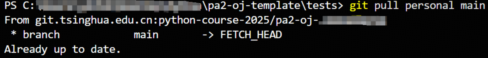

# 仓库拉取教程

相信在之前的学习中，大家已经初步了解了在自己仓库中进行 git 操作，比如 `git add`、`git clone`、`git commit`、`git push`。

不过，我们在更多情况下使用 git 是为了与他人合作，那么如何将自己代码与他人代码以不冲突的方式合并呢？

---

## 前置知识回顾

我们已经掌握了一些基础的 Git 命令：

* `git clone`：克隆远程仓库到本地
* `git add`：将修改添加到暂存区
* `git commit`：提交修改
* `git push`：推送代码到远程仓库

但多人协作时，我们还需学会：

* 添加多个远程仓库
* 从其他远程仓库拉取代码
* 合并或重放（rebase）改动
* 解决冲突

---

## 克隆你的作业仓库

```bash
git clone https://git.tsinghua.edu.cn/<git-space>/<repo-name>.git
cd <repo-name>
```

```shell
git clone https://git.tsinghua.edu.cn/python-course-2025/pa2-oj-2025123456.git
Cloning into 'pa2-oj-2025123456'...
remote: Enumerating objects: 3, done.
remote: Counting objects: 100% (3/3), done.
remote: Compressing objects: 100% (2/2), done.
remote: Total 3 (delta 0), reused 0 (delta 0), pack-reused 0 (from 0)
Receiving objects: 100% (3/3), done.
```

!!! warning
    如果 clone 时提示需要登录，用户名（username）是你清华 GitLab 的 ID；密码则需要前往 GitLab 的 **User settings → Personal access tokens** 创建一个 access token 来填入（不是你的登录密码）。


你可以用以下命令查看所有远程仓库：

```bash
git remote -v
```

??? info
    git 默认会将直接 clone 下来的仓库源名设置为 `origin`

你应该看到类似输出

```shell
origin	https://git.tsinghua.edu.cn/python-course-2025/pa2-oj-2025123456.git (fetch)
origin	https://git.tsinghua.edu.cn/python-course-2025/pa2-oj-2025123456.git (push)
```

## 自动化配置（可选）

你也可以设置默认拉取行为（避免每次都提示）：

```bash
# 只对当前仓库设置
git config pull.rebase true

# 或对全局设置（所有仓库生效）
git config --global pull.rebase true
```

## 常见问题

- 如果你发现已经输出 `Already up to date`，可以检查下目前 pull 的源名是否绑定了预期仓库。比如此处 personal 绑定了自己的个人仓库。

