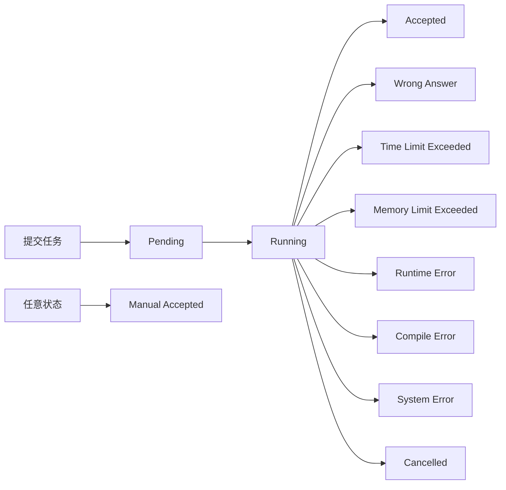

## Step 4：状态管理

---

### 模块目标

本模块目标是为 OJ 系统构建完整的评测任务管理系统，实现：

* 每个提交成为一个独立任务；
* 任务具有标准生命周期（状态流转）；
* 提供任务查询、重新评测、删除等接口；
* 加入基础任务调度机制，实现评测队列；
* 为后续扩展调度系统和并发评测打下基础。

---

## 前置知识要求

| 技术点              | 推荐学习/工具                                    |
| ---------------- | ------------------------------------------ |
| 枚举 Enum          | Python 的 `enum.Enum` 定义状态值                 |
| 多线程与锁机制          | `threading.Thread` + `threading.Lock` 管理并发 |
| 数据结构设计           | 使用字典、列表管理任务状态与调度队列                         |
| RESTful API 路由设计 | GET / PUT / DELETE 等任务操作接口                 |
| 时间处理             | 使用 `datetime` 获取与格式化创建/更新时间                |

---

## 实验任务

---

### 任务 1：定义任务结构与状态

任务状态建议使用枚举控制合法值：

```python
from enum import Enum

class JobStatus(str, Enum):
    # 队列状态
    PENDING = "Pending"      # 等待评测
    RUNNING = "Running"      # 正在评测
    
    # 评测结果状态
    ACCEPTED = "Accepted"    # 完全正确
    WRONG_ANSWER = "Wrong Answer"  # 答案错误
    TIME_LIMIT_EXCEEDED = "Time Limit Exceeded"  # 超时
    MEMORY_LIMIT_EXCEEDED = "Memory Limit Exceeded"  # 超内存
    RUNTIME_ERROR = "Runtime Error"  # 运行时错误
    COMPILE_ERROR = "Compile Error"  # 编译错误
    SYSTEM_ERROR = "System Error"  # 系统错误
    
    # 特殊状态
    CANCELLED = "Cancelled"  # 用户取消
    MANUAL_ACCEPTED = "Manual Accepted"  # 人工通过
```

任务对象字段：

```python
{
  "id": 42,
  "user_id": 1,
  "problem_id": 1001,
  "language": "cpp",
  "priority": 0,  # 继承自用户角色
  "status": "Pending",
  "result": [ 
    { 
      "test_id": 1, 
      "status": "Accepted", 
      "score": 20, 
      "time": 0.123,
      "memory": 32,
      "stderr": "...",
      "input": "...",
      "expected": "...",
      "actual": "..."
    }
  ],
  "score": 90,
  "create_time": "2025-06-21T10:00:00",
  "update_time": "2025-06-21T10:00:30",
  "judge_log": {
    "compile_output": "...",
    "system_message": "...",
    "manual_comment": null
  }
}
```

你可以在内存中维护以下结构：

```python
job_list = []  # 所有任务列表
job_queue = PriorityQueue()  # 优先级队列
job_lock = threading.Lock()
job_id_counter = 1
```

---

### 任务 2：实现任务调度与评测主循环

添加一个后台线程，定期执行队首任务：

```python
def judge_worker():
    while True:
        with job_lock:
            if not job_queue.empty():
                priority, job = job_queue.get()
                job["status"] = JobStatus.RUNNING
        
        if job:
            try:
                result = run_judger(job)  # 你应已在 Step 2 实现该方法
                job.update(result)  # 更新评测结果
            except Exception as e:
                job["status"] = JobStatus.SYSTEM_ERROR
                job["judge_log"]["system_message"] = str(e)
            finally:
                job["update_time"] = now()
        time.sleep(0.1)
```

新任务一旦创建应直接放入 `job_queue` 中，优先级由用户角色决定。

---

### 任务 3：任务 API 接口实现

#### GET /jobs

* 查询所有任务；
* 支持参数筛选：`user_id`、`problem_id`、`status`；
* 支持分页参数：`page=1&page_size=10`；
* 支持排序参数：`sort_by=create_time&order=desc`。

#### GET /jobs/{id}

* 返回单个任务信息；
* 若不存在返回 404。

#### PUT /jobs/{id}

* 对已完成的任务重新评测；
* 需验证当前任务状态为终态（非 Pending/Running）；
* 创建新任务，继承原任务的 user_id、problem_id 等信息；
* 新任务状态设置为 `Pending`，重新入队执行。

#### DELETE /jobs/{id}

* 删除指定任务；
* 普通用户只能删除自己的任务；
* 管理员可删除任意任务；
* 若任务正在评测中（Running），需先取消评测；
* 建议只做逻辑删除（标记 deleted），避免物理删除带来的问题。

---

### 任务 4：任务状态流转控制

任务状态需严格遵守以下流程：



状态流转规则：
* 新建任务默认状态为 `Pending`；
* 评测线程启动时修改为 `Running`；
* 评测结束更新为对应结果状态；
* 非终态任务禁止重评；
* 状态不能随意逆跳或越级；
* 管理员可将任意状态改为 `Manual Accepted`。

---

### 任务 5：支持任务优先级与队列可见性

任务优先级继承自用户角色：

```python
job["priority"] = user["submit_quota"]["priority"]  # admin=-1, user=0
```

提供接口：

```http
GET /jobs/queue
```

返回当前排队中任务列表：

```json
{
  "total": 42,
  "items": [
    {
      "job_id": 100,
      "user_id": 1,
      "problem_id": 1001,
      "create_time": "2025-06-21T10:00:00",
      "priority": 0,
      "position": 1
    }
  ]
}
```

---

### 自测建议

编写自动测试或手工测试用例，验证以下行为：

| 测试项           | 操作说明                  | 期望行为             |
| ------------- | --------------------- | ---------------- |
| 正常提交任务        | POST /jobs，查看返回 ID    | 状态为 Pending，自动入队 |
| 状态流转检查        | 查看状态变化日志              | 按顺序变化，不能跳转错误     |
| 查询任务列表        | GET /jobs             | 正确返回任务集合         |
| 查询任务详情        | GET /jobs/{id}        | 返回完整任务 JSON      |
| 重评操作合法性       | 非终态任务 PUT 应拒绝        | 返回 400 错误        |
| 删除权限控制        | 普通用户删他人任务应返回 403      | 权限校验生效           |
| 多任务调度顺序正确（队列） | 多用户提交后查看状态变化时间与顺序     | 按优先级调度           |
| 取消运行中任务       | DELETE 正在评测的任务        | 任务被取消，状态更新       |
| 人工评测状态变更      | admin 修改任务状态为 Manual  | 状态变更，记录操作日志      |

---

## 附加功能建议（推荐纳入基础功能）

| 项目          | 说明                                               |
| ----------- | ------------------------------------------------ |
| 优先级任务支持     | 继承用户角色优先级，决定调度顺序                              |
| 任务队列可见性接口   | `GET /jobs/queue` 返回待执行任务信息                      |
| 状态统计接口      | `GET /jobs/stats` 返回每种状态下任务数量                    |
| 支持分页与筛选查询   | `GET /jobs?user_id=1&page=2&page_size=10` 实现分页响应 |
| 批量重评/删除任务支持 | `PUT /jobs?user_id=1` 重新入队当前用户所有已完成任务            |
| 任务取消接口      | `POST /jobs/{id}/cancel` 取消尚未执行或正在执行的任务          |

---

## 模块结构建议

| 模块路径                | 说明                  |
| ------------------- | ------------------- |
| `models/job.py`     | 定义 Job 数据模型、状态枚举与结构 |
| `routes/jobs.py`    | 路由接口定义及权限控制         |
| `services/queue.py` | 任务调度线程、任务入队/出队逻辑实现  |
| `utils/time.py`     | 格式化时间、获取当前时间戳等辅助函数  |

---

## 小结

| 能力项    | 说明                             |
| ------ | ------------------------------ |
| 任务建模   | 每个评测任务结构清晰，含状态、分数、时间、用户等信息     |
| 状态控制   | 状态只能按合法流转，不可随意修改               |
| API 能力 | 支持任务创建、查询、删除、重新评测等多种操作         |
| 调度能力   | 具备基本调度线程、优先级队列机制，支持用户角色优先级     |
| 权限管理   | 普通用户/管理员权限分离，支持人工评测与任务管理       |